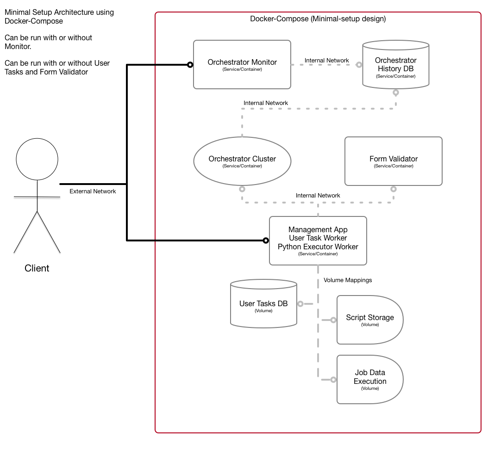
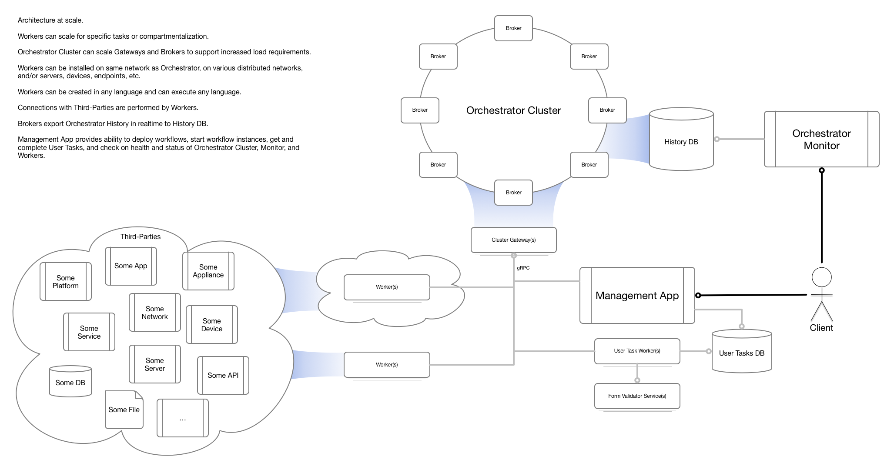

# Architecture

## Simple Docker-Compose setup with minimal components

This is the docker-compose architecture setup for the minimal setup that uses the various components.

Generally used for local executions, development, demos, testing, etc.

## Architecture at scale

This is sample of using SimpleSOAR at scale, where all components can scale horizontally and be distributed to various networks and devices as desired.

