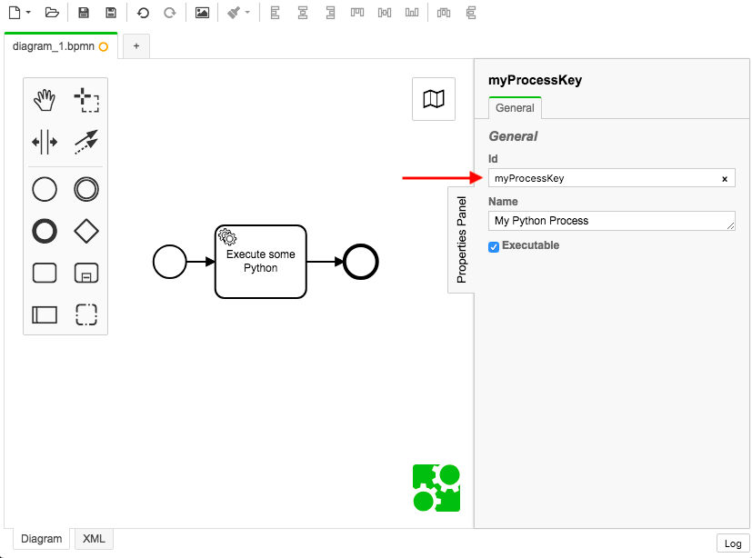

# Management App

The Management App is the web application that provides orchestrator management functionality.

## Workflow Deployment

Workflow deployment to the Orchestrator involves having a .bpmn file created by the [modeler](../Modeler/BPMN-Modeler.md), and uploading the workflow to the Management App, which will deploy the workflow/.bpmn file into the Orchestrator.

If you deploy a workflow with a Timer start event, the workflow will start automatically.

If you deploy a workflow with a blank-start event (most common type of start event), you will need to use the Management App to create a instance of the workflow.

You can deploy a workflow using the API:

POST `localhost:8080/management/workflow/deployment`

**form-data:**

key: `workflow`

value: `[your workflow/.bpmn file]`


## Create a Instance of a Workflow

You can start a instance of a workflow using the API:

POST `localhost:8080/management/workflow/instance`

```json
{
  "workflowKey": "myProcessKey",
  "startVariables": {
    "someKey": "someVar",
    "ip_list": ["0.0.0.0", "127.0.2.5"]
  }
}
```

The workflowKey property is **required**, and must be the `Id` value in your workflow:



When starting a workflow using the workflowKey, the most recent deployment of the workflow will be used.


The `startVariables` property is **optional**.  This property contains the variables that are to be injected into the created workflow instance.  You typically use start variables to provide initial configuration and data to inject into your workflows when they execute tasks.  You may also use startVariables to inject reference data into a process such as a ticket-number, department-owner, source-generating-system, etc.


## Configuration

The Management App has the following configuration in the Application.yml file.

```yml

...

```