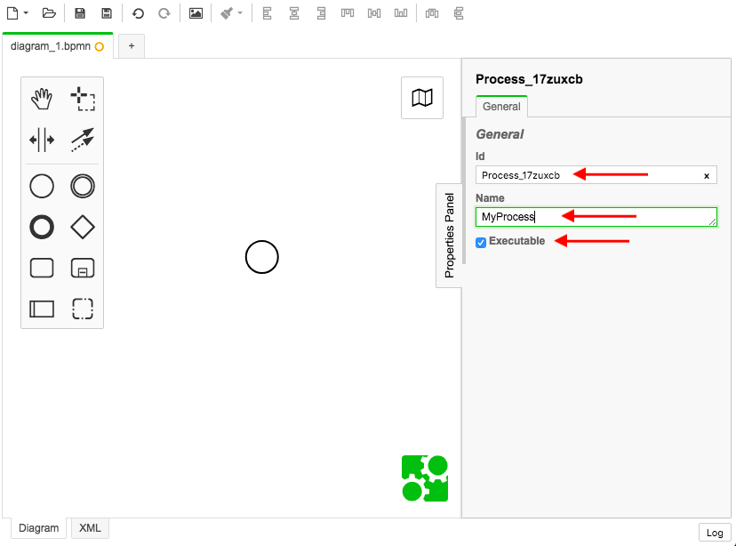
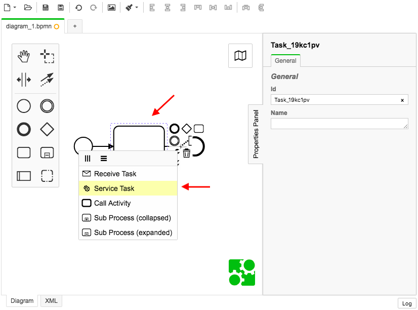
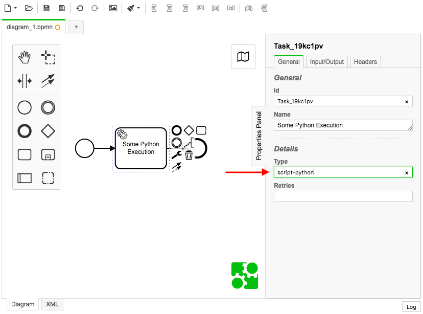

# BPMN Modeler / Workflow Modeler

The BPMN modeler is a desktop electron application that provides a drag-and-drop visual modeler to create and maintain your workflows.

## Download the Modeler

1. Go to the modeler's [releases page](https://github.com/zeebe-io/zeebe-modeler/releases) and download the latest release for your OS.  Windows, Mac, and Linux are supported.

1. The modeler is called "Zeebe Modeler".  Zeebe is the name of the orchestrator technology that runs the BPMN executions.  Install the Zeebe Modeler on your OS

1. Open the modeler and start creating!

## Basics of the Modeler

To create a basic workflow you are required to configure the BPMN with some basics.  The following is a simple one task workflow that executes a Python script.

1. Setup the Process Id, this is the workflowKey which will be used later to create a instance of the workflow.  Ensure the Process ID is unique, and typically it helps to make it memorable.  The Name is a business friendly name of the workflow.  Ensure the Executable checkbox is checked or else your workflow cannot be started once deployed.

   

2. Add a task and set it to a Service Task

   

3. For the orchestrator to understand how to route tasks to specific Workers, you need to set the "type" of the task.  This is similar concept as a "Topic" in other Message queue systems.  Workers subscribe to the "type".  For the python worker, the type is `script-python`.

   

4. Set the headers of the task with the name of the script you want to execute.  In this case we have a script called `myScript.py`, so the key is `script`, and the value is `myScript.py`.  The `myScript.py` file is located on the Python Worker.  The Script header is to tell the worker which specific script we want to execute for this task.

   

5. Save the workflow as a .bpmn file.

You are now ready to deploy the .bpmn file / workflow into the Orchestrator.